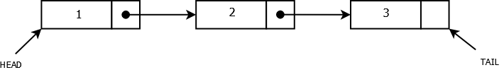

# Singly linked list

## Quick recap about lists

If we remember the definition of arrays, we need a contiguous memory of area in which we are storing a collection of entries by using integer indexes.

A list is also a collection of entries, but it does not require a whole block of memory area, because a list is a collection of nodes scattered in memory. 

Each node consists of two parts:
-	**data payload**. It can be a number, a string, or any other data structure we want to store inside the node.
-	**reference to the next node**. Thanks to this reference, we can sequentially attach one node to another and create a "chain" of nodes, *i.e. a list of nodes*.

If we think again to the list of nodes as a chain of rings, there will be a **head** node that marks the list's first node and a **tail** node that represents the list's last node.

The number of nodes in a list is also known as **size** of a list.

## Operations on a singly linked list

When we are working with a singly linked list, the main constraint is that we need to *traverse* the list by **hopping** nodes: starting from the head, we read the reference to the next node. Then, inside the next node, we read the reference to the next-next node and so on until we reach the tail node.

The first class of operations is the insertion of a new node, and the two most basic ways of doing it are either from the head (*add as first item*) or from the tail (*add as last item*).