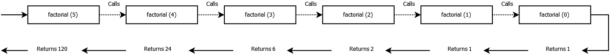

# Linear congruential generator

## Recap about recursion

*“Recursion”* means that we are defining a certain problem in terms of “smaller versions” of the problem itself.

Recursion is everywhere. 

In mathematics, the **factorial** of a certain natural number is defined in terms of the previous number: 

    n! = n * (n-1)!

Then we also have plants, such as ferns or *“romanesco broccoli,”* with leaves or inflorescences that display a recursive structure.

There are two parts in a recursive problem:

- **base condition**. Since a recursive problem works on smaller versions of the problem, we will reach a point where we can tell what the solution is, without additional recursive steps.

- **recursive step**. The solution of our problem is defined in terms of the solution itself, but applied to a smaller version that is moving towards the base condition.

For example, if we consider the factorial n! of a natural number n:

- base condition happens when n = 0 because, by definition, we have that 0! = 1

- recursive step is applied to n > 0 and is defined as n! = n * (n-1)!

Let us now calculate 5! by going through all the recursive steps, until we reach the base condition:

- 5! = 5 * 4!
- 4! = 4 * 3!
- 3! = 3 * 2!
- 2! = 2 * 1!
- 1! = 1 * 0!

And the solution to the problem is **5! = 120**

Why would we want to work with this mind-twisting thing? Well, because some problems definitions can become more compact and easier to read if we use a recursive definition.

Just think about binary trees: how would you concisely define them without a recursive approach?

From a computer’s point of view, recursion can be implemented as a function or a method that calls itself.
Such a function or method has a set of arguments that describes the problem to solve.
Every single time the recursive function or method is called, its arguments will describe a “smaller” problem to solve.

For example, in Javascript:

    const factorial = function (n) {
        if (n===0) {
            return 1;
        }
        return n * factorial(n-1);
    }

And if we run this function passing 5 as input parameter, the result will be:

## Linear congruential generator

A common problem that we all have when writing software is the generation of random numbers.

For several reasons, a normal computer can only approximate a random numbers generator and one of the best-known algorithms that generate pseudo random numbers is called *“linear congruential generator”*, or **LCG**.

LCG is defined with a recursive relation:

Zn+1 = (a Zn+c) mod m

The recursive step says that the (n+1)-th pseudo random number is defined as the product between the previous n-th pseudo random number and a “multiplier” **a**, then the addition of this product with an *“increment”* **c**, and lastly, we calculate the sum modulus by **m**.

The base condition happens when n = 0, because Z0 will be a constant called **“seed”** or **“start value”**.

Here follows the Java implementation of LCG: [Java implementation](https://github.com/nicola-piccolo/data-structures-and-algorithms/blob/dev/src/main/java/com/github/nicolapiccolo/recursion/linearCongruentialGenerator/LinearCongruentialGenerator.java).

## Clean code tip #3 Shared magic numbers and other literals

**Examples**

    next = current + 100;
    delay = val * 3600;
    addr = “https://” + url;

**Why is it bad?**

Code with plain, literal numbers and strings is hard to read and maintain. 

Every time we encounter them, we need to stop and try to remember the meaning of each explicit value.

Moreover, replacing magic numbers or string literals with new values is a risky operation because we could forget to update some old occurrences.

**How to fix this?**

First, for each magic number or string literal define a constant with a proper name that can explain the meaning of its value.

Next, clean up the code by using these self-explanatory constants in lieu of the explicit values.

**Fixed examples**

    nextActionTimestamp = currentActionTimestamp + ACTION_WAIT_TIME_MS;
    intervalDurationSeconds = delayHours * SECONDS_IN_HOUR;
    redirectUrl = HTTPS_PROTOCOL + webSiteDomainName;
